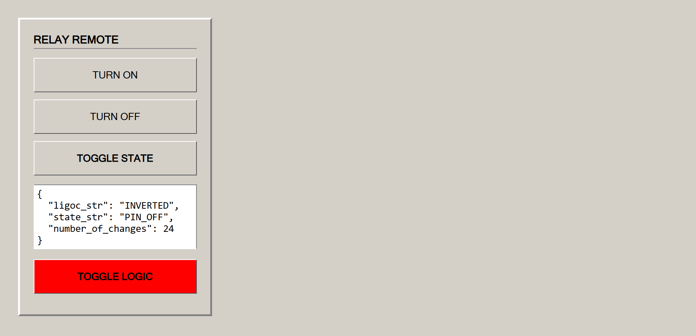

<!--
  SPDX-License-Identifier: Apache-2.0
  Example: relay_control_server
  Folder: ./examples/relay_control_server
  File: README.md
  
  Copyright 2026 AmakeSasha
  
  Licensed under the Apache License, Version 2.0 (the "License");
  you may not use this file except in compliance with the License.
  You may obtain a copy of the License at
  
      http://www.apache.org/licenses/LICENSE-2.0
  
  Unless required by applicable law or agreed to in writing, software
  distributed under the License is distributed on an "AS IS" BASIS,
  WITHOUT WARRANTIES OR CONDITIONS OF ANY KIND, either express or implied.
  See the License for the specific language governing permissions and
  limitations under the License.
-->

# Relay Control

An example of controlling a relay via a web interface based on the [`esp_iot_framework_server`](../../components/esp_iot_framework_server/README.md).

## Relay connection pins (Supports Low-Level trigger or High-Level trigger modules)
* `RELAY_PIN` -> GPIO 13
* `GND` -> Common ground

## API documentation
A full description of all available endpoints, JSON structure, and management commands is located in the [REST_API.md](./REST_API.md) file.