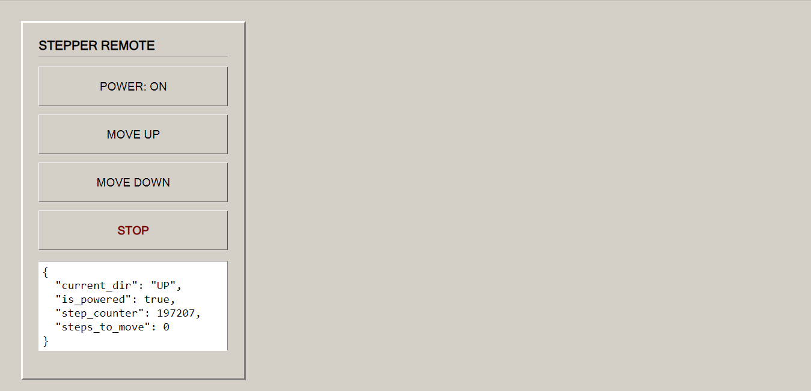

# Stepper Control

An example of controlling a stepper motor via a web interface based on the `esp_iot_framework_device`.

## Stepper motor driver connection pins (A4988 and the like)
* `STEP_PIN` -> GPIO 13
* `DIR_PIN` -> GPIO 27
* `SLEEP_PIN` (Power) -> GPIO 14
* `GND` -> Common ground

## API documentation
A full description of all available endpoints, JSON structure, and management commands is located in the [REST_API.md](./REST_API.md) file.
